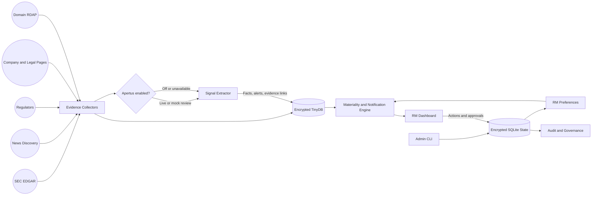

# SignalWatch

**AI-powered, evidence-backed early warning for KYC drift, financial crime risk, and relationship opportunities.**

SignalWatch turns periodic KYC snapshots into a living company-intelligence system. It monitors public sources, detects material changes against the bank's existing customer baseline, preserves the exact supporting evidence, and delivers a concise decision workflow to the right Relationship Manager (RM).

The core experience is simple:

> Here is what the bank knew before, what changed, why it matters, the source that proves it, and what the RM should do next.

SignalWatch was built for the SwissHacks 2026 AMINA challenge: **How can AI become an early-warning and signal system for financial crime and customer changes?**

## Why SignalWatch Stands Out

- **Living KYC instead of periodic snapshots.** SignalWatch continually compares new evidence with the last reviewed customer baseline.
- **Risk and opportunity in one workflow.** It can surface sanctions or regulatory exposure alongside events such as expansion, acquisitions, funding, and new digital-asset activity.
- **Evidence before assertion.** Every finding retains source links, excerpts, timestamps, provenance, confidence, and human-review status.
- **Decision support, not another data dump.** Alert details answer five plain-language questions in the order an RM needs them.
- **Personalized signal delivery.** Global alerts become RM notifications only after passing that RM's watchlist, freshness, category, severity, confidence, and materiality policy.
- **Governed AI with deterministic fallback.** Apertus can review documents and suggest severity, while rules preserve an explainable path when AI is disabled or unavailable.
- **Bank-minded controls.** Authentication, authorization, encryption, CSRF protection, maker-checker approvals, append-only actions, audit chaining, and cost telemetry are built into the application.

## 60-Second Developer Summary

SignalWatch is a Python application with a browser dashboard. There is no frontend build step and no JavaScript package installation.

1. Create a Python environment.
2. Install four pinned dependencies.
3. Create a login user.
4. Start the server.
5. Open the dashboard and select a company.

```powershell
python -m venv .venv
.\.venv\Scripts\Activate.ps1
python -m pip install --upgrade pip
python -m pip install -r requirements.txt
python -m server.manage_users create --username admin --display-name "Security Admin" --role admin
python -m server.app --host 127.0.0.1 --port 8000 --workers 4 --ai-mode off
```

Open [http://127.0.0.1:8000/dashboard/](http://127.0.0.1:8000/dashboard/) and sign in with the password you entered during user creation.

That command runs the complete deterministic product locally using the bundled demo intelligence. External AI credentials are optional.

## What You Can Demo

1. **Personalized notifications:** open the Notifications tab to see material signals qualified for the active RM.
2. **Fast company discovery:** search the portfolio by company, alert, or signal and see an explicit filtered-result count.
3. **Persistent customer context:** select a company to see its RM, last review, current risk rating, and alert summary in a separate customer band.
4. **Company-level exploration:** before selecting an alert, explore the Activity Log and Geographic Footprint.
5. **Evidence-backed geography:** select a jurisdiction to see why it appears and open the supporting evidence. A jurisdiction is elevated only when country-specific evidence indicates sanctions, blocking, prohibition, illegality, or licence loss.
6. **Executive alert narrative:** select an alert and review the five decision questions:
   - **What changed?**
   - **Why does it matter?**
   - **What should I do?**
   - **What supports this finding?**
   - **What else should I know?**
7. **Before and after comparison:** inspect exactly which KYC fields drifted from the baseline.
8. **Governed action:** acknowledge, escalate, request an update, add the item to a call brief, or dismiss it with an audit note.
9. **Governance:** use the Governance tab to review approvals, verify the audit chain, and inspect model cost telemetry.

Use **Back to company overview** to leave an alert and return to the company timeline and map. Company exploration and alert review are intentionally separate, so company-wide context is not repeated inside every alert.

## Product Model

SignalWatch distinguishes three related objects:

| Object | Meaning |
|---|---|
| **Evidence** | A retrieved filing, regulator publication, company page, legal disclosure, RDAP record, or reputable news item. |
| **Alert** | A structured, scored change detected by comparing evidence with a customer baseline. |
| **Notification** | An alert that passes a specific RM's policy and belongs in that RM's current feed. |

This separation keeps the evidence global, the change explainable, and the final delivery personal.

## How It Works



### End-to-End Flow

1. Scheduled or manual jobs materialize the current customer baselines and source catalog in an isolated temporary workspace.
2. Connectors retrieve public evidence with source quality, retrieval metadata, and provenance.
3. Apertus optionally reviews documents, checks entity relevance, extracts supported claims, preserves verbatim evidence, and suggests severity.
4. The deterministic extractor compares supported facts with the previous KYC snapshot and creates structured alerts.
5. Material scoring prioritizes business impact, confidence, source quality, change type, and human-review requirements.
6. The notification engine evaluates the global alerts independently against every RM's policy.
7. Qualified notifications appear in the RM dashboard with evidence and action controls.
8. Review actions, approvals, security events, and model costs are written to governed application state.

## Evidence Pipeline

The implemented connector family includes:

- **SEC EDGAR:** filings and company facts for public issuers.
- **Regulator discovery:** official regulator publications and enforcement evidence.
- **Company-site discovery:** newsroom, investor-relations, product, and corporate pages.
- **Direct sources:** explicitly curated high-quality URLs.
- **Page-diff watch:** monitored product and legal pages whose content may change without a publication date.
- **Domain RDAP:** country-code and domain-control changes that may indicate market entry or require confirmation.
- **News-event discovery:** GDELT-style discovery with curated public fallbacks and original publisher links.

Connectors preserve source URLs and collection metadata. The pipeline treats a source as evidence, not truth by default: entity matching, baseline comparison, source quality, confidence, and human review remain part of the decision.

### Strong Connector Expansion Path

The architecture can add official feeds without changing the alert or notification contracts:

| Need | Strong public starting points |
|---|---|
| Sanctions | US Treasury OFAC, UN Consolidated List, EU consolidated sanctions data, Swiss SECO |
| Legal entities | GLEIF, UK Companies House, Swiss Zefix, SEC EDGAR |
| Adverse media | GDELT and curated publisher or regulator feeds |
| Registry and ownership | National registries, LEI relationships, filings, and customer-provided ownership schedules |

Recommended source references:

- [OFAC Sanctions List Service](https://ofac.treasury.gov/sanctions-list-service)
- [UN Security Council Consolidated List](https://main.un.org/securitycouncil/en/content/un-sc-consolidated-list)
- [EU consolidated financial sanctions dataset](https://data.europa.eu/data/datasets/consolidated-list-of-persons-groups-and-entities-subject-to-eu-financial-sanctions?locale=en)
- [Swiss SECO sanctions search](https://www.seco.admin.ch/seco/en/home/Aussenwirtschaftspolitik_Wirtschaftliche_Zusammenarbeit/Wirtschaftsbeziehungen/exportkontrollen-und-sanktionen/sanktionsmassnahmen/suche_sanktionsadressaten.html)
- [GLEIF API](https://www.gleif.org/en/lei-data/gleif-api)
- [UK Companies House API](https://developer.company-information.service.gov.uk/developer-guidelines)
- [Swiss Zefix Public REST API](https://www.zefix.admin.ch/ZefixPublicREST/swagger-ui/index.html)
- [SEC EDGAR APIs](https://www.sec.gov/search-filings/edgar-application-programming-interfaces)
- [GDELT DOC API](https://blog.gdeltproject.org/gdelt-doc-2-0-api-debuts/)

Production deployments should verify current provider terms and rate limits. Commercial products may still be appropriate for PEP coverage, adverse-media breadth, entity resolution, service guarantees, or licensed bank use. SignalWatch is designed to integrate those providers rather than lock the bank into one data source.

## AI, Explainability, and Scoring

SignalWatch supports three AI modes:

| Mode | Behavior | Best use |
|---|---|---|
| `off` | Deterministic extraction only; no external model call. | Local development, secure demos, predictable fallback. |
| `mock` | Exercises the model path with deterministic mock behavior. | Tests and controlled demonstrations. |
| `live` | Calls the configured Apertus OpenAI-compatible endpoint. | Live evidence review and model telemetry. |

AI does not silently replace provenance. Under **What supports this finding?**, the UI distinguishes:

- whether Apertus reviewed the source document;
- whether AI or deterministic rules extracted the final signal;
- the model and validation status;
- the exact evidence quote;
- direct supporting source links; and
- whether a human review is required.

Material scores remain deterministic and auditable. Apertus severity suggestions can influence ranking, but source-backed controls explicitly weight sanctions, OFAC or DPRK context, ransomware, regulatory scrutiny, ownership and control drift, jurisdiction drift, and human-review requirements above routine opportunities.

## RM Workflow and Preferences

Each enabled RM has a portfolio, an IANA timezone, and an independent notification policy. In **Notification settings**, an RM can configure:

- watchlist customers;
- lookback window;
- minimum material score;
- minimum confidence;
- categories and severities;
- signal types;
- source URL requirements; and
- evidence freshness behavior.

The in-process scheduler creates jobs at **07:00 and 13:00 in each RM's local timezone**. Closely timed RM jobs can share retrieval completed within the previous ten minutes, while notification qualification remains independent for each RM. Saving a policy or choosing **Run refresh now** queues an immediate refresh.

This controlled schedule fits a bank monitoring workflow and avoids pretending that public KYC intelligence is a real-time market-data stream.

## Storage Architecture

SignalWatch uses the right storage model for each kind of data:

### TinyDB Document Intelligence

`runtime/signalwatch.documents.json` stores flexible, schema-free intelligence collections such as:

- customers and baselines;
- public evidence and collection traces;
- extracted facts and alerts;
- material alerts and suppression results;
- AI analysis and provenance;
- internal signals and fused intelligence;
- public KYC enrichment; and
- founder and investor context.

On first run it is initialized from `storage/signalwatch.seed.json`, which provides a substantial ready-to-demo dataset.

### SQLite Application State

`runtime/signalwatch.db` stores relational workflow state:

- users and role assignments;
- relationship managers and portfolios;
- sessions;
- notification preferences and assignments;
- refresh jobs;
- RM review actions;
- maker-checker approvals;
- audit events; and
- cost telemetry.

Worker logs are stored under `runtime/jobs/`. Pipeline work occurs in isolated temporary job directories; successful outputs are imported into TinyDB and temporary files are removed.

## Security and Governance

SignalWatch demonstrates that a strong prototype can include serious control design:

- Passwords use Argon2id with unique 128-bit salts and a 64 MiB memory cost.
- Authentication uses 384-bit opaque session tokens in `HttpOnly`, `SameSite=Strict` cookies; only keyed token digests are stored.
- Sessions have an eight-hour absolute lifetime and a 30-minute idle timeout.
- State-changing APIs require a session-bound CSRF token and same-origin validation.
- Runtime TinyDB documents and sensitive SQLite fields use AES-256-GCM with fresh nonces and context-bound associated data.
- RM users are limited to assigned portfolios; compliance and admin users can operate across portfolios; auditors are read-only.
- Sensitive internal fields are masked from roles without clearance.
- Review actions are append-only.
- Escalation, dismissal, and customer-update requests use maker-checker approval by a different compliance or admin user.
- Security and workflow events are HMAC hash-chained and verified in the Governance tab.
- Workers record stage duration, model-reported token use, configured rates, and estimated cost. Zero usage is explicit when no model is called.

`SIGNALWATCH_DATA_KEY` can provide a URL-safe base64 32-byte key from a secrets manager. Without it, SignalWatch creates `runtime/signalwatch.key` for local development. A production deployment should inject the key from managed KMS or HSM infrastructure.

## Installation and Configuration

### Requirements

- Python 3.10 or newer
- PowerShell for the examples below, or equivalent shell commands

The pinned dependencies are intentionally small:

- TinyDB for document intelligence;
- Argon2 for password hashing;
- Cryptography for AES-GCM encryption; and
- tzdata for reliable IANA timezones on Windows.

```powershell
python -m venv .venv
.\.venv\Scripts\Activate.ps1
python -m pip install --upgrade pip
python -m pip install -r requirements.txt
```

### Optional Apertus Configuration

Copy the template for local live-AI development:

```powershell
Copy-Item .env.example .env
```

```text
APERTUS_API_KEY=
APERTUS_BASE_URL=
APERTUS_MODEL=
```

`APERTUS_BASE_URL` can be an OpenAI-compatible `/v1` base URL or a full `/chat/completions` endpoint. The same values can be supplied through the process environment, which is the preferred production approach.

Never commit credentials or place them in JSON artifacts, documentation examples, or frontend code.

### Cost Telemetry

Supply contracted rates through the server process environment when running live AI:

```text
SIGNALWATCH_MODEL_INPUT_USD_PER_1M=
SIGNALWATCH_MODEL_OUTPUT_USD_PER_1M=
```

## User Management

Passwords are entered through a secure prompt, must be at least 14 characters, and must contain mixed character classes.

```powershell
python -m server.manage_users create --username admin --display-name "Security Admin" --role admin
python -m server.manage_users create --username mara --display-name "Mara Keller" --role rm --rm-id rm-mara-keller
python -m server.manage_users create --username checker --display-name "Compliance Checker" --role compliance
python -m server.manage_users create --username auditor --display-name "Read Only Auditor" --role auditor
python -m server.manage_users list
```

Supported roles are `admin`, `compliance`, `rm`, and `auditor`.

## Running the Server

### Deterministic Local Mode

```powershell
python -m server.app --host 127.0.0.1 --port 8000 --workers 4 --ai-mode off
```

### Live Apertus Mode

```powershell
python -m server.app --host 127.0.0.1 --port 8000 --workers 4 --ai-mode live
```

### HTTPS Mode

Non-loopback binding requires a TLS certificate and key. TLS also forces the `Secure` cookie flag.

```powershell
python -m server.app --host 0.0.0.0 --port 8443 --secure-cookie `
  --tls-cert .\certs\server.pem --tls-key .\certs\server-key.pem
```

Show all options:

```powershell
python -m server.app --help
python -m server.manage_users --help
```

## Tests

The repository uses the Python standard-library test runner, so no test framework dependency is required.

```powershell
python -m unittest discover -s tests -v
```

The tests cover:

- AI response validation and deterministic fallback;
- source-quote verification;
- notification qualification;
- preference validation;
- timezone-aware scheduling;
- TinyDB document behavior;
- encrypted persistence;
- Argon2 salting;
- worker persistence;
- authentication and authorization;
- maker-checker approvals;
- audit-chain integrity; and
- cost telemetry.

Tests use mocked model responses and do not call the live Apertus API.

## Project Structure

```text
dashboard/     Browser UI: HTML, CSS, and vanilla JavaScript
server/        HTTP server, security, state, scheduler, workers, notifications
scripts/       Evidence connectors, AI review, extraction, scoring, imports
storage/       Encrypted-document seed source
data_01..09/   Reproducible challenge artifacts and intelligence layers
tests/         Unit and HTTP integration tests
specs/         Hackathon implementation specifications and evaluation artifacts
docs/          Compatibility pointers to this canonical README
```

The dashboard loads `amCharts` for the interactive world map when the CDN is available and falls back to a local static map when it is not.

## Production Evolution

SignalWatch already demonstrates the complete product loop: collection, optional AI review, baseline comparison, explainable scoring, personalized delivery, decision support, approvals, and auditability.

The natural path from this strong MVP to a regulated deployment is:

1. connect enterprise SSO and managed KMS or HSM services;
2. add licensed production sanctions, PEP, registry, AML, and adverse-media connectors;
3. formalize retention, data residency, and public/internal isolation policies;
4. export the audit chain to external WORM or SIEM storage;
5. add production observability, retry and dead-letter controls, backups, and high availability; and
6. benchmark false positives and reviewer workload against bank-approved evaluation sets.

These are infrastructure and operating-model extensions around an architecture that already preserves evidence, human accountability, and source-level explainability.

## Everyday Developer Checklist

- Start locally with `--ai-mode off`.
- Use the bundled seed data before collecting anything new.
- Create users through `server.manage_users`; do not edit passwords into the database.
- Keep `.env`, `runtime/`, and keys out of Git.
- Run `python -m unittest discover -s tests -v` before committing.
- Use direct source links and exact evidence quotes when adding new cases.
- Treat elevated geography as company exposure supported by evidence, not as a claim that an entire country is sanctioned.
- Put durable project documentation here so this README remains the single source of truth.

## Git Safety Check

Confirm local secrets are ignored:

```powershell
git check-ignore -v .env
```

`InitialPrompt.md` is retained as the original hackathon challenge brief. The root README is the canonical product, developer, architecture, and operations documentation.
